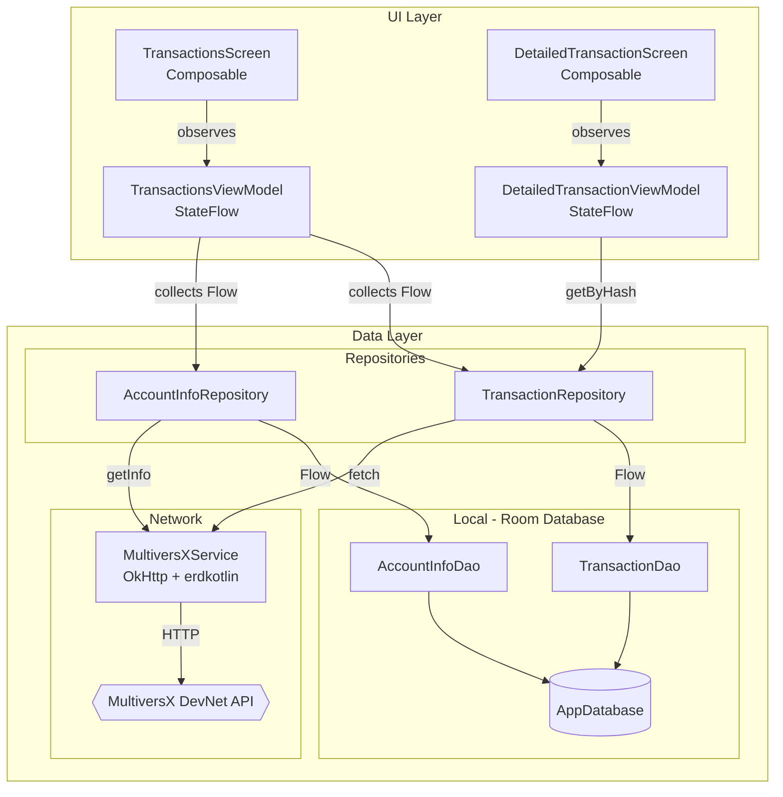
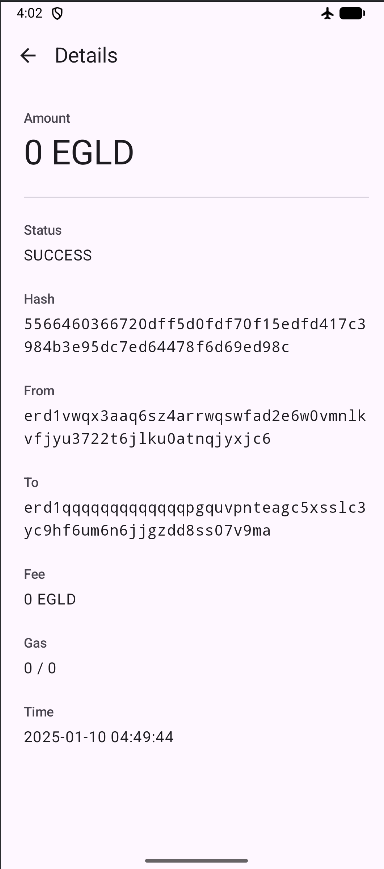
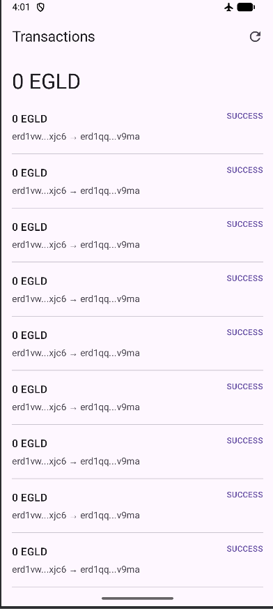

# MC Project

A MultiversX blockchain transaction viewer built as a single-module Android application with Kotlin and Jetpack Compose.

## Overview

MC Project is an Android application that displays blockchain data from the MultiversX DevNet, including:
- Account information (address, balance, nonce)
- Transaction history with detailed view
- Offline caching for seamless user experience

## Key Features

- **Real-time Blockchain Data**: Fetches live transaction data from MultiversX DevNet API
- **Offline Support**: Local caching with Room database - data persists when offline
- **Pull to Refresh**: Manual refresh button to fetch latest transactions
- **Transaction Details**: Tap any transaction to view full details (hash, sender, receiver, value, gas, status, etc.)
- **Material Design 3**: Modern UI with Material3 theming and edge-to-edge display

## Tech Stack

| Category | Technology | Version |
|----------|------------|---------|
| Language | Kotlin | 2.0.21 |
| UI Framework | Jetpack Compose | BOM 2024.10.01 |
| Architecture | MVVM + Repository Pattern | - |
| Local Database | Room | 2.6.1 |
| Async | Kotlin Coroutines + Flow | 1.9.0 |
| Networking | OkHttp | 4.12.0 |
| Design | Material Design 3 | 1.13.0 |
| Blockchain SDK | erdkotlin | 0.4.0 |
| Android SDK | API 24-36 | - |

## Architecture

The app follows **MVVM (Model-View-ViewModel)** architecture with a **Repository Pattern** for clean separation of concerns.



### Data Flow

1. **UI** observes `StateFlow` from ViewModel
2. **ViewModel** collects `Flow` from Repository
3. **Repository** combines data from Room (local cache) and Network (MultiversX API)
4. **Room** provides reactive `Flow` that automatically updates UI when data changes
5. **Network** fetches fresh data and updates Room database

## Project Structure

```
app/src/main/java/com/vti/mcproject/
├── MCProjectApplication.kt      # Application class with AppContainer
├── MainActivity.kt              # Single Activity with Compose UI
│
├── ui/
│   ├── AppViewModelProvider.kt  # ViewModel factory
│   ├── screens/
│   │   ├── TransactionsScreen.kt        # Main transactions list
│   │   └── DetailedTransactionScreen.kt # Transaction details
│   └── viewmodel/
│       ├── TransactionsViewModel.kt
│       └── DetailedTransactionViewModel.kt
│
├── data/
│   ├── model/
│   │   ├── Transaction.kt       # @Entity for Room
│   │   └── AccountInfo.kt       # @Entity for Room
│   ├── local/dao/
│   │   ├── AppDatabase.kt       # Room Database
│   │   ├── AppContainer.kt      # Dependency Container
│   │   ├── TransactionDao.kt    # Transaction DAO
│   │   └── AccountInfoDao.kt    # AccountInfo DAO
│   ├── repository/
│   │   ├── TransactionRepository.kt
│   │   └── AccountInfoRepository.kt
│   └── network/
│       └── MultiversXService.kt # API client
│
├── di/                          # (Reserved for future DI)
└── utils/                       # (Reserved for utilities)
```

## Getting Started

### Prerequisites
- JDK 17+
- Android Studio Ladybug or newer
- Android device/emulator (API 24+)

### Build & Run

```bash
# Build
gradlew.bat build        # Windows
./gradlew build          # Linux/Mac

# Install
gradlew.bat installDebug
./gradlew installDebug
```

## Configuration

The app connects to MultiversX DevNet by default:
- **API Endpoint**: `https://devnet-api.multiversx.com`
- **Contract Address**: `erd1qqqqqqqqqqqqqpgquvpnteagc5xsslc3yc9hf6um6n6jjgzdd8ss07v9ma`

## Screenshots

- Transactions Page:



- Detailed Transaction Page:
  

